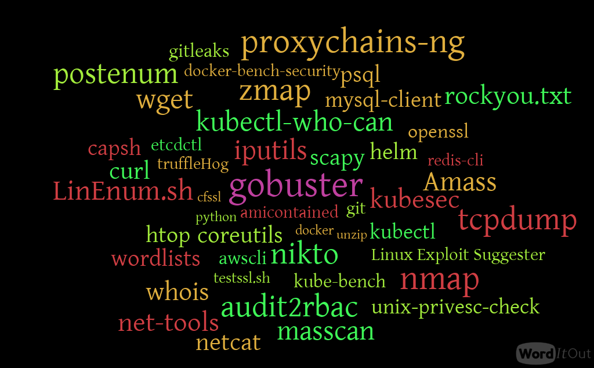
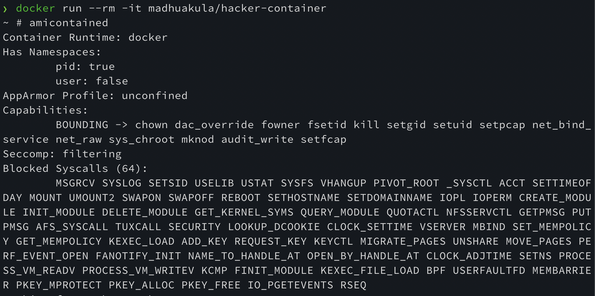

# Hacker Container

[](https://github.com/madhuakula/hacker-container/blob/master/LICENSE)
[](https://twitter.com/intent/tweet/?text=Container%20with%20all%20the%20list%20of%20useful%20tools%20and%20commands%20while%20hacking%20Kubernetes%20Clusters%20created%20by%20%40madhuakula&url=https://github.com/madhuakula/hacker-container)

Container with all the list of useful tools/commands while hacking Kubernetes Clusters



* List of the tools/commands/utilities available in container are **[list.todo](list.todo)**

## How to use Hacker Container

* Just run the following command to explore in the docker container environments

```bash
docker run --rm -it madhuakula/hacker-container
```

* To deploy as a Pod in Kubernetes cluster run the following command

```bash
kubectl run -it hacker-container --image=madhuakula/hacker-container
```

> This container can be used in different ways in different environments, it aids your penetration testing or security assessments of container and Kubernetes cluster environments.

## Hacker Container in Action



### Feedback/Suggestions

> Please feel free to [create issue](https://github.com/madhuakula/hacker-container/issues/new) or make a pull request or tweet to me [@madhuakula](https://twitter.com/madhuakula) for improvements and suggestions
